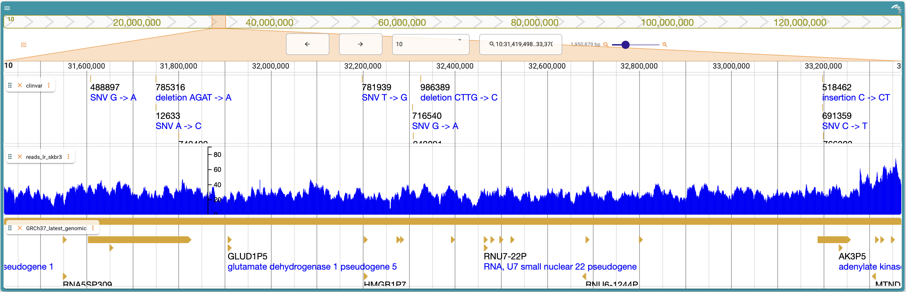

```{r setup, include=FALSE}
knitr::opts_chunk$set(echo = TRUE)
```

## Abstract

### Motivation

Genome browsers are an essential tool in genome analysis. 
Modern genome browsers enable complex and interactive visualization of a wide variety of genomic data modalities. 
While such browsers are very powerful, they can be challenging to configure and program for bioinformaticians lacking expertise in web development.

### Results

We have developed an R package that provides an interface to the JBrowse 2 genome browser. 
The package can be used to configure and customize the browser entirely with R code. 
The browser can be deployed from the R console, or embedded in Shiny applications or R Markdown documents.

### Availability

JBrowseR is available for download from CRAN, and the source code is openly available from the Github repository at \href{https://github.com/GMOD/JBrowseR/}{https://github.com/GMOD/JBrowseR/}. 

## Introduction

The development of genome browsers has been described as a milestone of the
genomic revolution [@packer2007clickable].
Genome browsers provide researchers with the ability to visualize and explore genomic annotations and
data.
Due to their widespread adoption and use, the linear display of genomic information along reference coordinates
is one of the most common representations of biological data in the 21st century.

Since their original development during the advent of genome sequencing [@kent2002human; @birney2004overview],
genome browsers have made considerable gains in performance and sophistication.
One important development has been the implementation of genome browsers in JavaScript, beginning with
JBrowse [@buels2016jbrowse].
Leveraging JavaScript---along with modern web technologies such as Canvas and SVG---makes it possible to move computation that previously took
place on a server into the client web browser, as well as offering a more responsive and
interactive experience to the user.

JBrowse 2 is an extensible platform for visualizing and integrating biological data,
consisting of a ground-up rewrite of JBrowse using ReactJS and TypeScript.
The platform can be configured and deployed with custom data and settings,
enabling research communities to develop and maintain curated sets of resources and data on 
the web, such as WormBase for the *C. elegans* community [@harris2010wormbase].

JBrowse 2 contains many new views and components, to be described in a later paper.
However, one core part is a React component that renders a configurable
linear genome browser, enabling researchers to embed custom browsers into existing React applications.
While the JBrowse 2 React linear genome view component is powerful and extensible, its use can
present an obstacle to bioinformaticians who don't have experience with React development.
On the other hand, the R programming language and environment is widely used in the bioinformatics community, 
as evidenced by the size and usage of efforts such as Bioconductor [@huber2015orchestrating].

To bridge this gap, we introduce JBrowseR, an R interface the JBrowse 2 genome browser. 
JBrowseR is an R package with functions for embedding a custom browser instance in a Shiny app, 
R Markdown document, or the R console.

## Materials and Methods

JBrowseR is implemented as an R package and distributed on CRAN.
The package was built according to the R best practices encoded in the devtools package,
ensuring continual use of R CMD Check and maintaining consistent and robust function documentation
during development.
The core rendering methods of the library rely on the htmlwidgets framework, which
can be used to embed JavaScript visualization tools in R Shiny apps, as well as R
Markdown documents. 
Htmlwidgets can also can be used from an R interactive console.
Using the reactR package, JBrowseR renders the JBrowse 2 widget inside of a root HTML
element in an htmlwidget.

The interface of JBrowseR enables users to generate JBrowse 2 configuration for their
own data using simple R functions. 
The configuration values can be composed together to create an arbitrarily
complex custom browser. The majority of genomic data formats
commonly displayed in genome browsers are supported,
including (but not limited to) FASTA, BED, GFF3, BAM, CRAM, VCF, Wiggle, and bigWig.
JBrowseR also includes an HTTP server for serving local data that is configured with
the necessary settings and features for working with genome browsers such as JBrowse
and IGV.js [@robinson2011integrative; @robinson2017variant].

The source code for JBrowseR is hosted on GitHub, and is automatically tested using
continuous integration running on the Windows, MacOS and Linux operating systems.
Automated tests for the package are implemented using the testthat R package.

```{r, echo=FALSE, out.width="100%", fig.cap="A custom JBrowse 2 genome browser generated using JBrowseR."}

```

## Results and Discussion

In order to demonstrate the utility of JBrowseR, several Shiny apps were built and are included along
with the package source code on GitHub. 
One of the included apps demonstrates adding CRAM, VCF, GFF3, and bigWig data (fig. 1), as well as 
setting a custom color palette for the browser.
Another one of the provided demo apps illustrates how JBrowseR can also be configured with a JSON
file (like other JBrowse 2 apps) by loading the SARS-CoV-2 reference genome and NCBI annotations
from a JBrowse 2 configuration file.
Finally, we have provided an example deployment of JBrowseR in an app with interactions connected to
other R shiny UI components at 
\href{https://elliothershberg.shinyapps.io/sars-cov-2-spike-mutations/}{https://elliothershberg.shinyapps.io/sars-cov-2-spike-mutations/}.

One of the core strengths of JBrowseR is its versatility. 
It considerably lowers the level of expertise required to
create a web-facing genome database with a fast and flexible genome annotation browser.
However, web applications are not the only available target point for the
rendering functions: JBrowseR can also embed a genome browser into R Markdown, a flexible documentation format
that is used to write scientific articles (including this one).
We anticipate that as platforms such as eLife's "reproducible article" [@maciocci2019introducing] mature
and become more widely adopted, it will be possible for genomics articles to contain interactive
genome browsers such as JBrowseR displaying their data.

## Availability

JBrowseR is freely available for download from CRAN, and the source code is publicly available at
\href{https://github.com/GMOD/JBrowseR/}{https://github.com/GMOD/JBrowseR/}. 
The package reference guide and tutorials can be found at
\href{https://gmod.github.io/JBrowseR/}{https://gmod.github.io/JBrowseR/}.

## Acknowledgements

We thank the reactR authors Kent Russell and Alan Dipert for creating and maintaining a clean interface
between React and htmlwidgets, which spurred the experiment into whether or not a package such as JBrowseR
would be feasible.

## Funding

This work was funded by NIH grants HG004483 and GM080203.

## References

